# Diagrammes

Ce document présente les relations principales du modèle de données de Cycling Manager.

Le schéma est volontairement séparé en plusieurs diagrammes afin de rester lisible.

---

## Vue d’ensemble du modèle métier

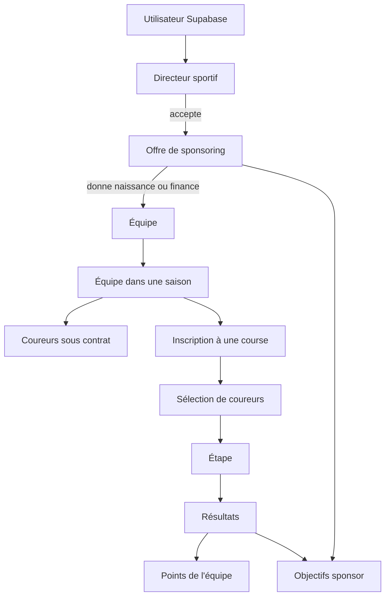

---

## Référentiels et saisons

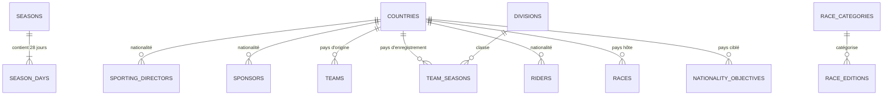

---

## Directeurs sportifs, sponsors et équipes

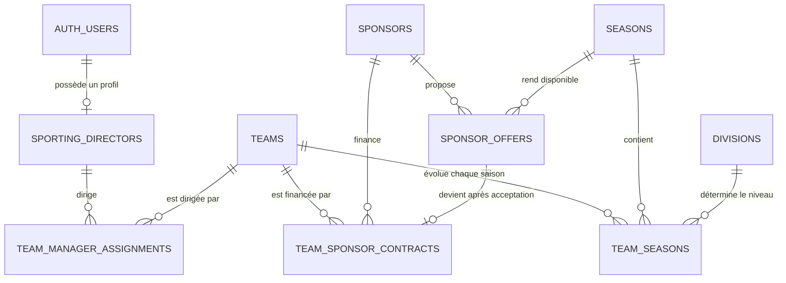

### Cycle de création d’une équipe

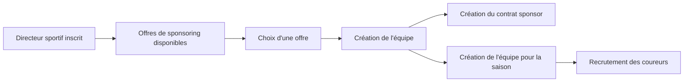

---

## Coureurs, contrats et statistiques

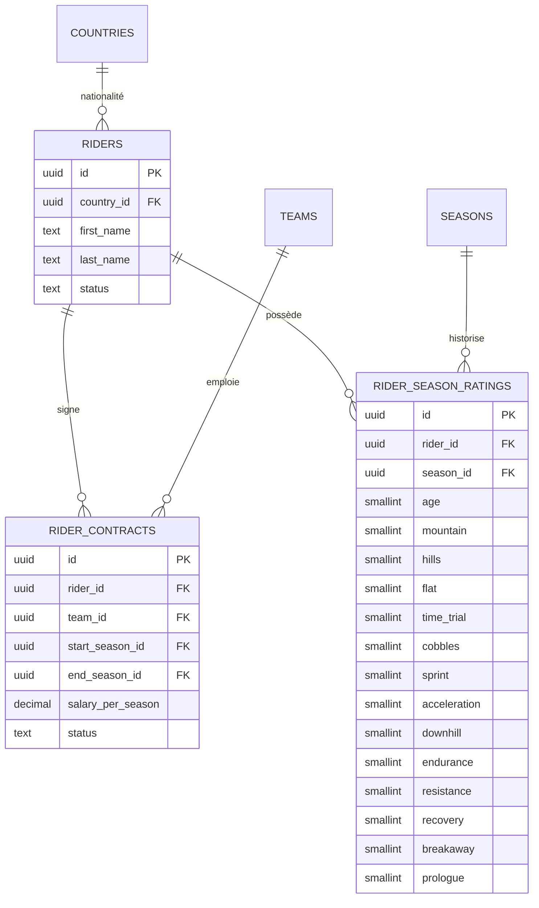

### Vieillissement d’un coureur

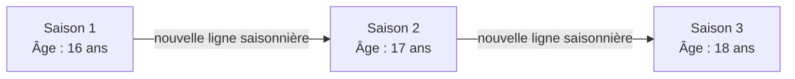

---

## Courses, éditions et calendrier

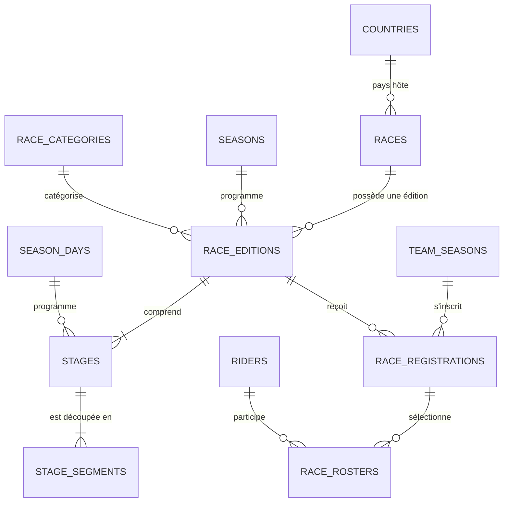

### Structure d’une course d’un jour

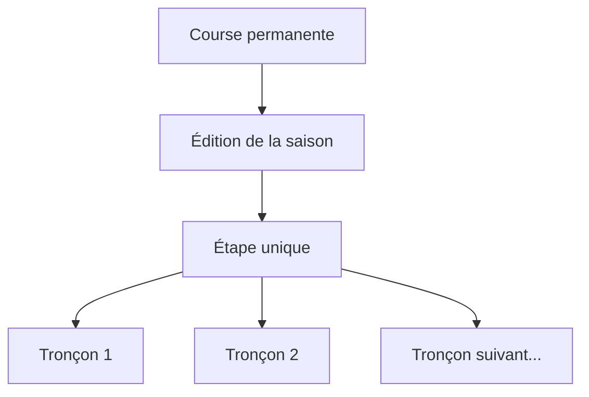

### Structure d’un tour

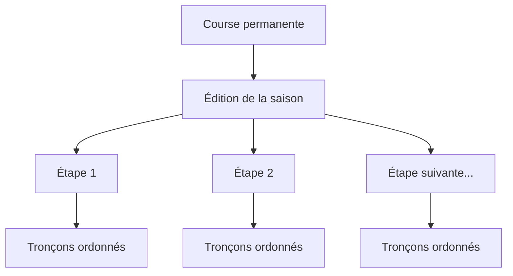

### Profil d’une étape

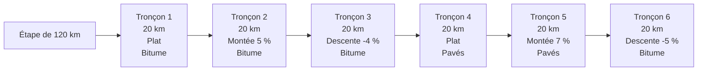

Le relief et le revêtement sont indépendants. Une montée ou une descente peut donc être bitumée ou pavée.

---

## Objectifs des sponsors

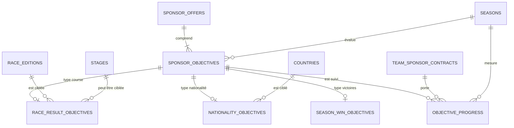

### Types d’objectifs disponibles

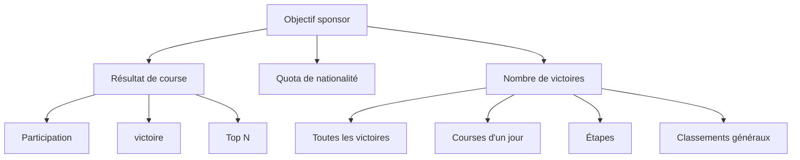

---

## Résultats et points

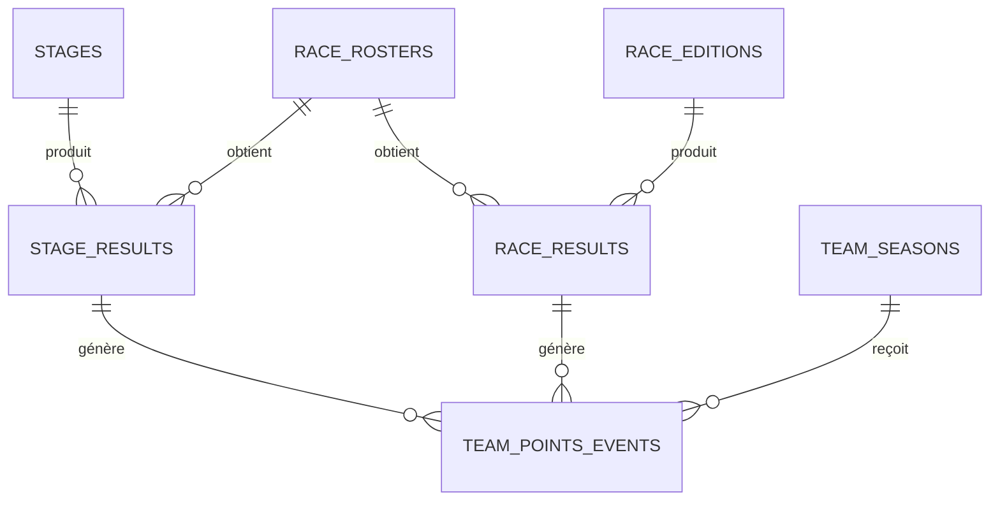

### Cycle sportif d’une journée

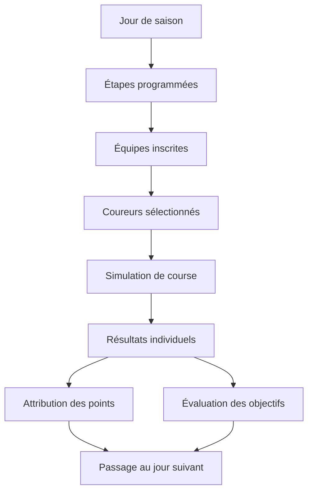

---

## Diagramme relationnel global simplifié

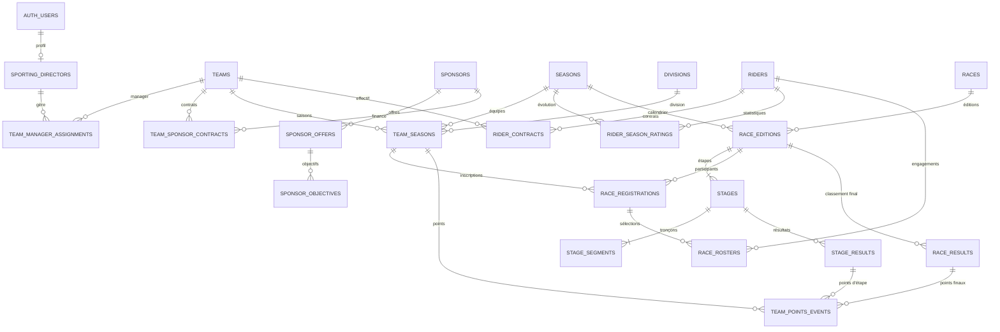

---

## Évolutions futures

Les éléments suivants seront ajoutés dans de futures User Stories :

- sélections nationales ;
- championnats mondiaux et continentaux ;
- staff ;
- équipement ;
- entraînement ;
- forme, fatigue et blessures ;
- négociations de contrats ;
- transferts ;
- sprints intermédiaires ;
- cols et difficultés répertoriées ;
- classements annexes ;
- plusieurs univers ou ligues de jeu.